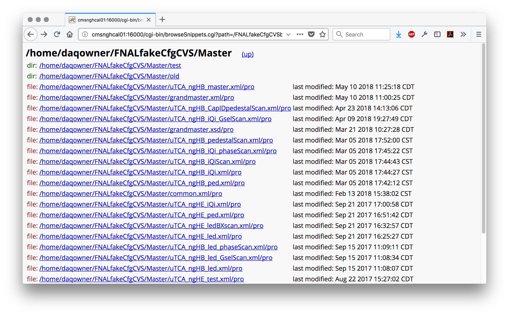

Guide to using FNAL web tools
=============================

This is a guide to using the custom FNAL web tools.

Homepage
--------

After setting up your ssh tunnel (see instructions [here](https://twiki.cern.ch/twiki/bin/view/CMSPublic/FNALHCalMicroTCATestStand#Login_Instructions)), visit http://cmsnghcal01.fnal.gov:16000/. You should see the main page with links to the other tools and assorted other links. 

browseSnippets
--------------

### Navigation pages

Links with names of snippets/directories in the (fake) CfgCVS will be displayed, along with a label indicating if the link corresponds to a snippet or a directory.

### Snippet display

After navigating through directories, when you click on a link to a file, the content of that snippet will be displayed.

getCfgScript
------------

This tool queries the FNAL RunInfo database to get the full CFG script as compiled by the hcalSupervisor in a given run. (This is a rewritten version of the perl script `getCfgScript.cgi` that runs on the P5 machine `hcalmon`.)

### Splash page

Enter the run number of the run whose CFG script you would like to retrieve

### CFG script display

Click "Submit query" and you will see a display of the CFG script used for that run.

diffCfgScripts
-------------

### Splash page

To see the differences between the CFG scripts used for two runs, enter their two run numbers. 

### Diff display

Click "Submit query" and you will see a diff of the two runs' CFG scripts.
