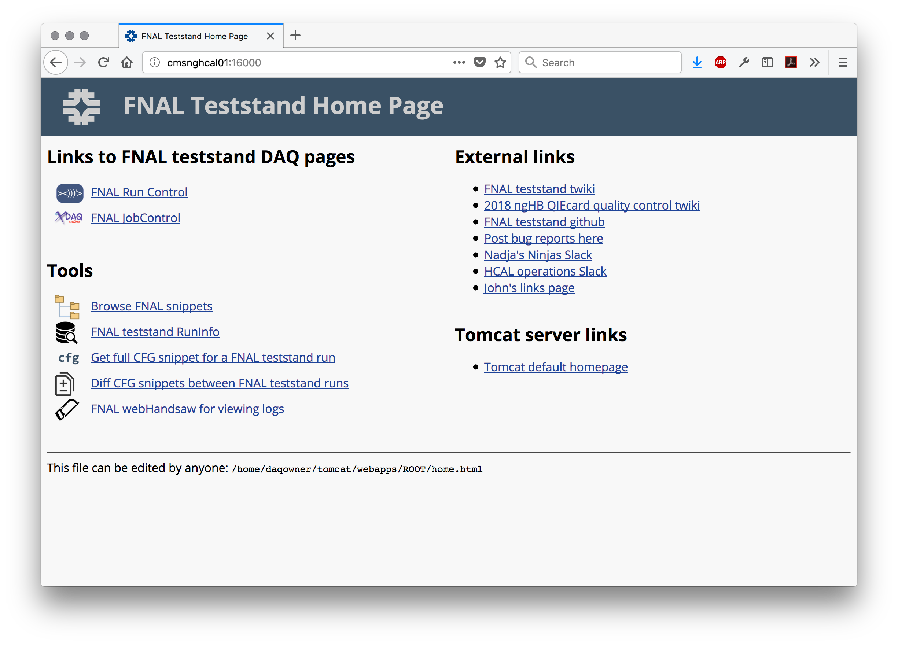

Guide to using FNAL web tools
=============================

This is a guide to using the custom FNAL web tools.

Homepage
--------

This page serves as the launch pad for using the FNAL web tools.

After setting up your ssh tunnel (see instructions [here](https://twiki.cern.ch/twiki/bin/view/CMSPublic/FNALHCalMicroTCATestStand#Login_Instructions)), visit http://cmsnghcal01.fnal.gov:16000/. You should see the main page with links to the other tools and assorted other links. 
     

browseSnippets
--------------

This tool allows one to browse the FNALfakeCfgCVS snippets via the web.

### Navigation pages

Links with names of snippets/directories in the (fake) CfgCVS will be displayed, along with a label indicating if the link corresponds to a snippet or a directory.

 

### Snippet display

  

After navigating through directories, when you click on a link to a file, the content of that snippet will be displayed.
    

getCfgScript
------------

This tool queries the FNAL RunInfo database to get the full CFG script as compiled by the hcalSupervisor in a given run. (This is a rewritten version of the perl script `getCfgScript.cgi` that runs on the P5 machine `hcalmon`.)

### Splash page

Enter the run number of the run whose CFG script you would like to retrieve
    

### CFG script display

  

Click "Submit query" and you will see a display of the CFG script used for that run.
       

diffCfgScripts
-------------

This tool also queries the FNAL RunInfo database, but retrieves the CFG scripts for two runs and runs a diff on them.

### Splash page

To see the differences between the CFG scripts used for two runs, enter their two run numbers. 
    

### Diff display

  

Click "Submit query" and you will see a diff of the two runs' CFG scripts.
      

getRunTypes
-----------

This tool again queries the FNAL RunInfo database, but compiles a list of runs organized by their local run key.

### Splash page

To see a list of recent runs that share the same local run key, enter a starting run number. All runs with run numbers equal to or greater than the one requested will be listed, grouped by their local run key.
    

### List display

  
Clicking the checkboxes next to two runs and hitting "Diff" will send the user to the corresponding diff from diffCfgScripts.
      

webHandsaw
----------

This tool provides a web interface to access the LogCollector logs formatted using the `Handsaw.pl` parser.

### Splash page

To see the logs, type a number of lines into the input box on the splash page. (This number is the number of lines of the xml file where the logs are encoded; so pick a number that is ~5 times larger than the number of log messages you'd like to see.) 
   

### Log display

  

Click "Submit query" and you will see the logs from the DAQ software collected by the LogCollector.
